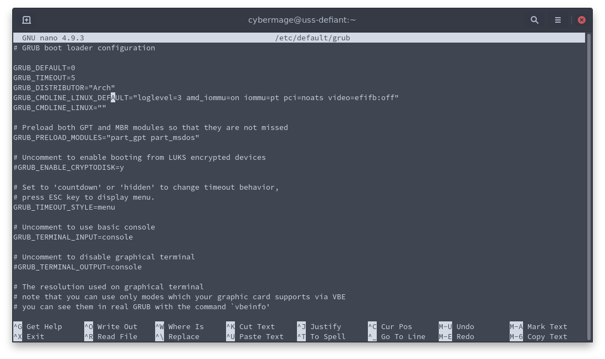

Editing GRUB

- intel_iommu=on for intel cpu's
- amd_iommu=on for amd cpu's

**arch / manjaro / fedora / Ubuntu / Linux Mint / OpenSUSE**

- sudo nano /etc/default/grub 

**popos!**

- sudo nano /boot/efi/loader/entries/Pop_OS-current.conf  

**ARCH LINUX:**

EDIT LINE:
GRUB_CMDLINE_LINUX_DEFAULT="amd_iommu=on iommu=pt"

UPDATE GRUB:
sudo grub-mkconfig -o /boot/grub/grub.cfg

**MANJARO**

EDIT LINE:
GRUB_CMDLINE_LINUX_DEFAULT="amd_iommu=on iommu=pt quiet apparmor=1 security=apparmor udev.log_priority=3"

UPDATE GRUB:
- sudo update-grub

**FEDORA**

edit line:
GRUB_CMDLINE_LINUX="resume=/dev/mapper/fedora_localhost--live-swap rd.lvm.lv=fedora_localhost-live/root rd.lvm.lv=fedora_localhost-live/swap amd_iommu=on iommu=pt quiet"

UPDATE GRUB:
- sudo grub2-mkconfig -o /boot/efi/EFI/fedora/grub.cfg

**POPOS!**

EDIT LINE:
options root=UUID=211de945-3abe-4b4e-87f1-4ec1a062d9b6 ro quiet loglevel=0 systemd.show_status=false amd_iommu=on iommu=pt splash

**NOTE:**

- sudo kernelstub --add-options "kvm.ignore_msrs=1"
- sudo kernelstub --add-options "iommu=pt"
 
and if it is an AMD CPU, use 

- sudo kernelstub --add-options "amd_iommu=on"
- sudo kernelstub --add-options "video=efifb:off"

if it is an Intel CPU, use 

- sudo kernelstub --add-options "intel_iommu=on"

- update grub
sudo bootctl update

**Ubuntu / Linux Mint**

EDIT LINE:
GRUB_CMDLINE_LINUX_DEFAULT="amd_iommu=on iommu=pt video=efifb:off quiet splash"

UPDATE GRUB:
- sudo update-grub

**Opensuse**

EDIT LINE:
GRUB_CMDLINE_LINUX_DEFAULT="amd_iommu=on iommu=pt splash=silent resume=/dev/disk/by-uuid/1652c07d-e2ba-4161-af2f-3e874eedfe1a mitigations=auto quiet"

UPDATE GRUB:
- sudo grub2-mkconfig -o /boot/grub2/grub.cfg

**IMPORTANT:**

REBOOT

