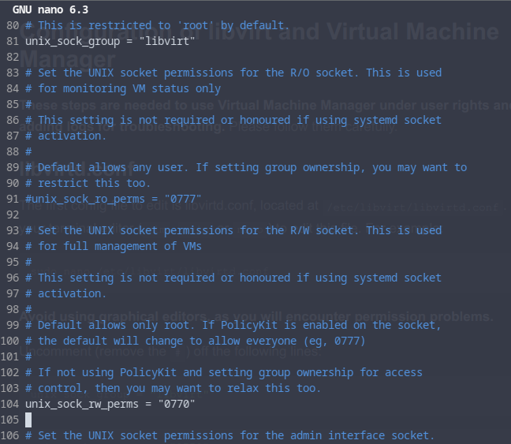
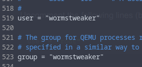

# Installing the virtualization packages

Now that we prepared both our bios, and grub, we need to install the necessary packages to do virtualization on our system. Refer to the list below with your corresponding system, and run the command(s) listed for your distro.

<details> 
  <summary><strong>Ubuntu, Linux Mint, Pop!_OS, and other debian based distro</strong></summary>

<pre>sudo apt install qemu-system-x86 libvirt-clients libvirt-daemon-system libvirt-daemon-config-network bridge-utils virt-manager ovmf</pre>

</details>

<details> 
  <summary><strong>Arch linux, and most Arch based distros</strong></summary>

  <pre>sudo pacman -S virt-manager qemu vde2 ebtables iptables-nft nftables dnsmasq bridge-utils ovmf</pre>

  <strong>Please note:</strong> Conflicts may happen when installing these programs.\
A warning like the below example may apear in your terminal:

`:: iptables and iptables-nft are in conflict. Remove iptables? [y/N]`

If you do encounter this kind of message, press `y` and `enter` to continue the installation.
</details>

<details> 
  <summary><strong>Fedora, and Fedora based distros</strong></summary>
  <pre>sudo dnf install @virtualization</pre>

  <strong>If you are following the Fedora part of this guide</strong>, take some time to check out the link below. It will help you going forward.\
<https://fedoramagazine.org/full-virtualization-system-on-fedora-workstation-30/>
</details>

<details> 
  <summary><strong>OpenSuse</strong></summary>
  <pre>sudo zypper in libvirt libvirt-client libvirt-daemon virt-manager virt-install virt-viewer qemu qemu-kvm qemu-ovmf-x86_64 qemu-tools</pre>
</details>

&nbsp;

## Configuration of libvirt and Virtual Machine Manager

**These steps are needed to use Virtual Machine Manager under user rights and adding logs for troubleshooting.** Please follow them carefully.

&nbsp;

### 1. libvirtd.conf

The first config file to edit is libvirtd.conf, located at `/etc/libvirt/libvirtd.conf`. Use your terminal editor (`vim`, `nvim` or `nano`) to edit this file. For example:
``` bash
sudo nano /etc/libvirt/libvirtd.conf
```
**Avoid using graphical editors, as you will encounter permission problems.**

#### 1.1 Read/Write permissions and group

Uncomment (remove the `#`) off the following lines:

``` bash
unix_sock_group = "libvirt"
```
``` bash
unix_sock_rw_perms = "0770"
```
You can find these between line 80 and 105 in the config file.

<details>
    <summary>Example of a correctly edited file</summary>
    
</details>

#### 1.2 Logging

**IMPORTANT:** You need this for detailed logs and troubleshooting.

Add these lines at the end of the file:

``` bash
log_filters="3:qemu 1:libvirt"
log_outputs="2:file:/var/log/libvirt/libvirtd.log"
```

#### 1.3 Adding your user to the libvirt group

You now need to add your user to the libvirt group, to allow libvirt to write files properly. This command assigns your user the libvirt group:
```bash
sudo usermod -a -G kvm,libvirt $(whoami)
```

You then need to enable and start the libvirtd service, just run these 2 commandes one after the other to do so:

``` bash
sudo systemctl enable libvirtd
```
``` bash
sudo systemctl start libvirtd
```


You can verify libvirt has been added to your users groups by using the following command.
```bash
sudo groups $(whoami)
```
It should return your current users groups like so.

`username libvirt` etc...

&nbsp;

### 2. qemu.conf

The second config file to edit is qemu.conf, located at `/etc/libvirt/qemu.conf`. Again, use your terminal editor to edit this file:

``` bash
sudo nano /etc/libvirt/qemu.conf
```

&nbsp;

Uncomment the following lines (between line 518 and 524) :

```bash
user = "root"
```
``` bash
group = "root"
```

And replace `root` with your username and your main user group:

```bash
user = "your username"
```
``` bash
group = "your username"
```
**Note:** On most distros, the main user group is simply your username, but in certain cases it is something else like "users", you can check your current user groups with the `groups` command 

<details>
    <summary>Example of a correctly edited file</summary>
    
</details>

&nbsp;

Then restart the libvirt daemon with the following.

``` bash
sudo systemctl restart libvirtd
```

&nbsp;


#### 2.1 Enabling the virtual machine default network

**Important:** This will make your virsh internal network automatically start when you start up your computer.

``` bash
sudo virsh net-autostart default
```

If you prefer not to have the virtual machine network start up automatically on boot, you have to run the following command before booting your VM, after each reboot of your host:

``` bash
sudo virsh net-start default
```