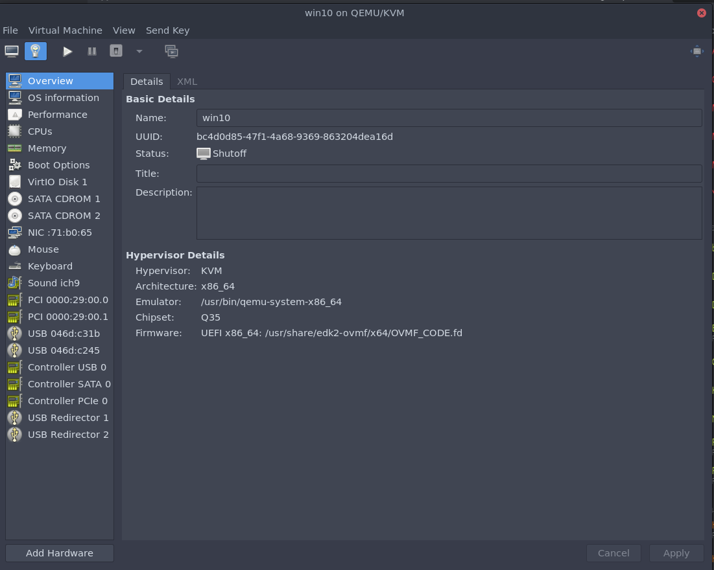
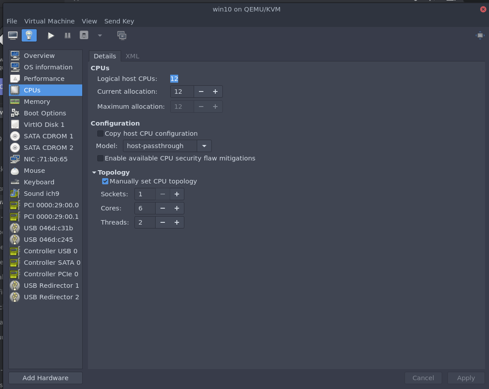
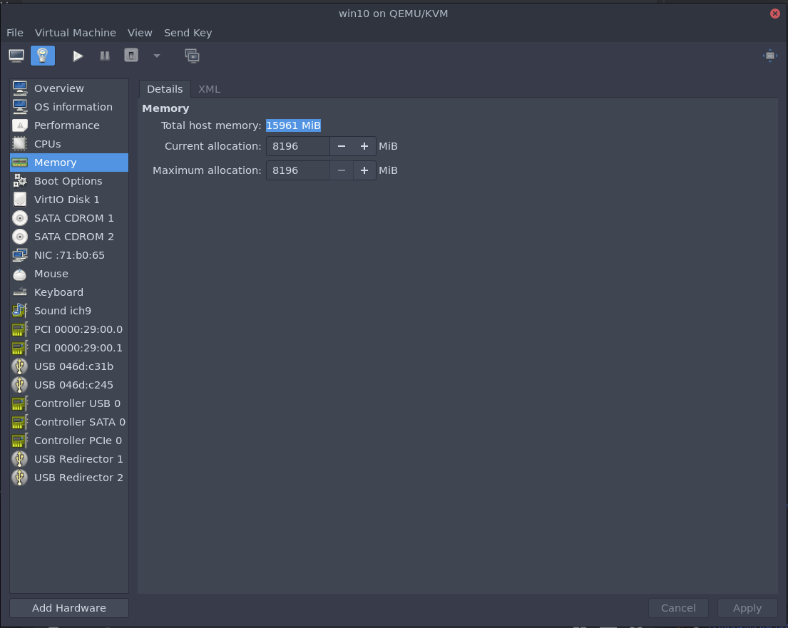
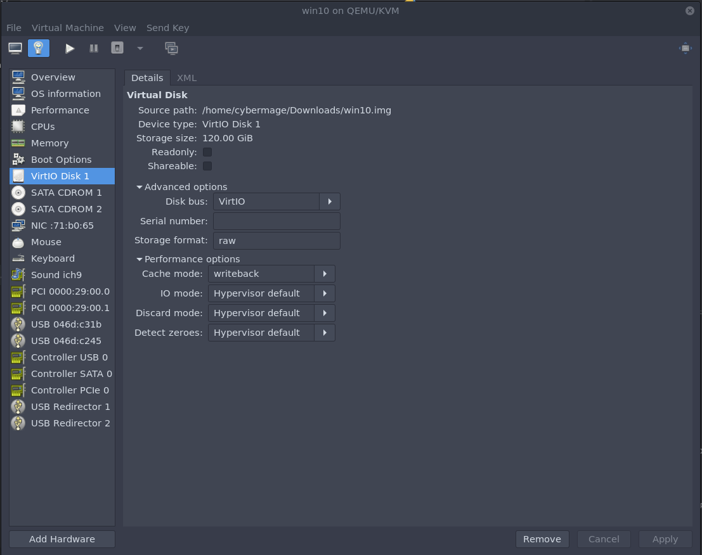
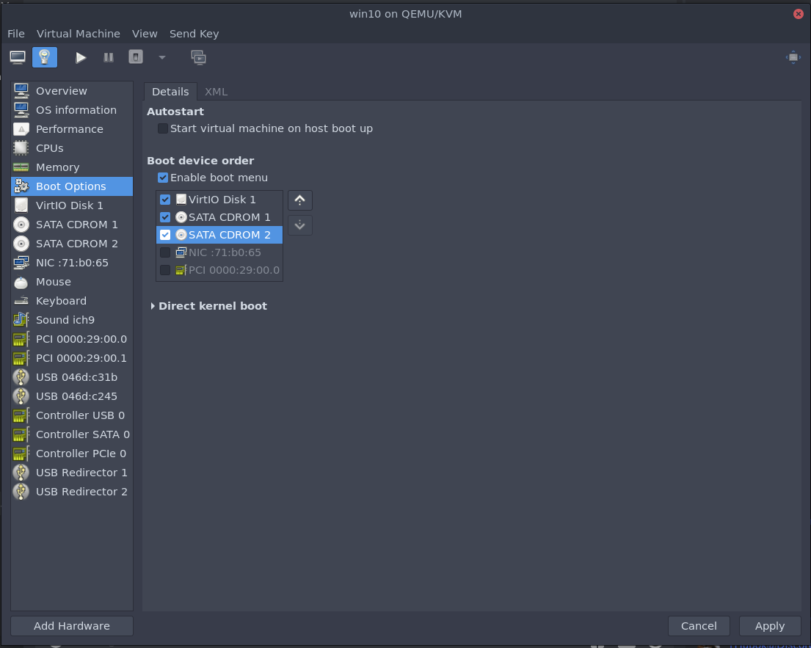
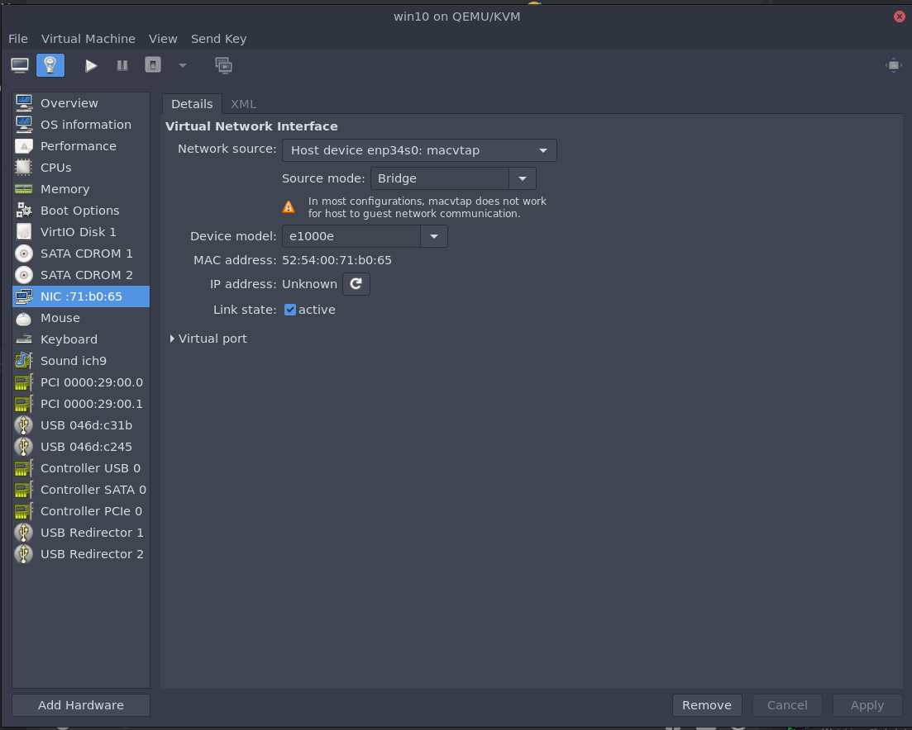
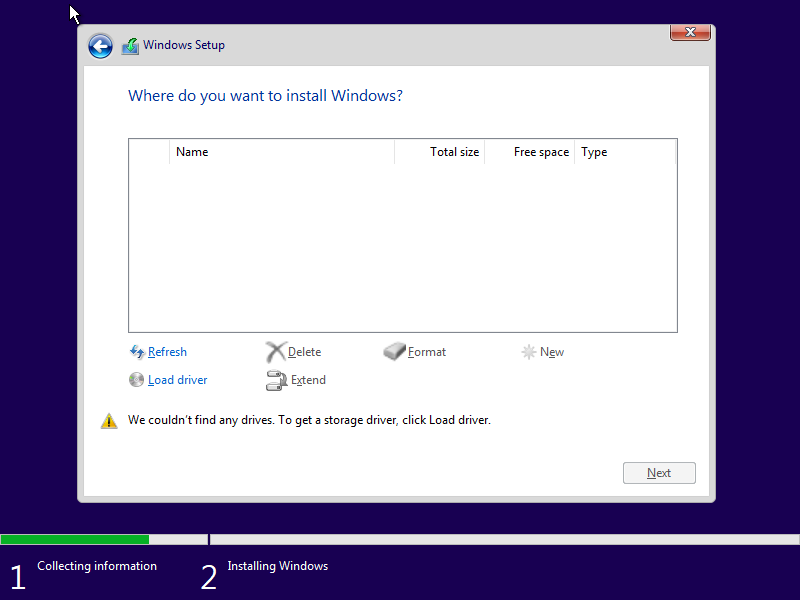
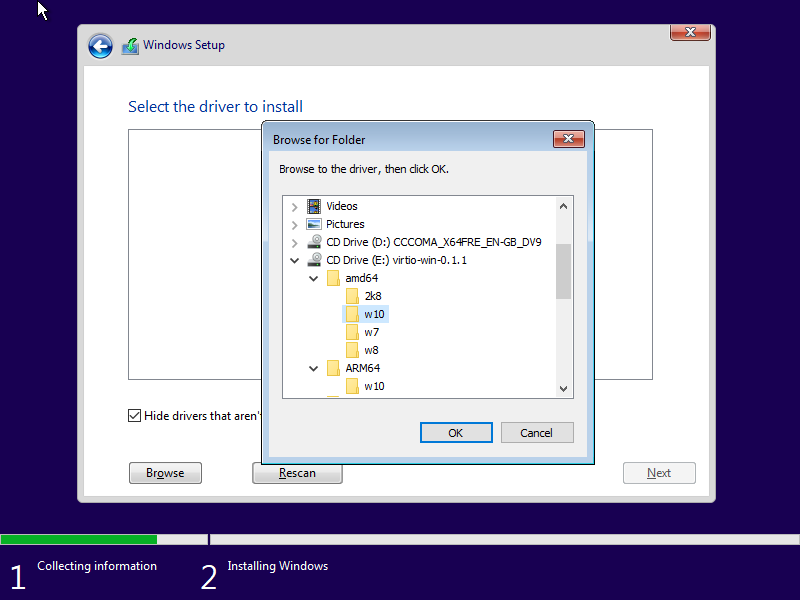
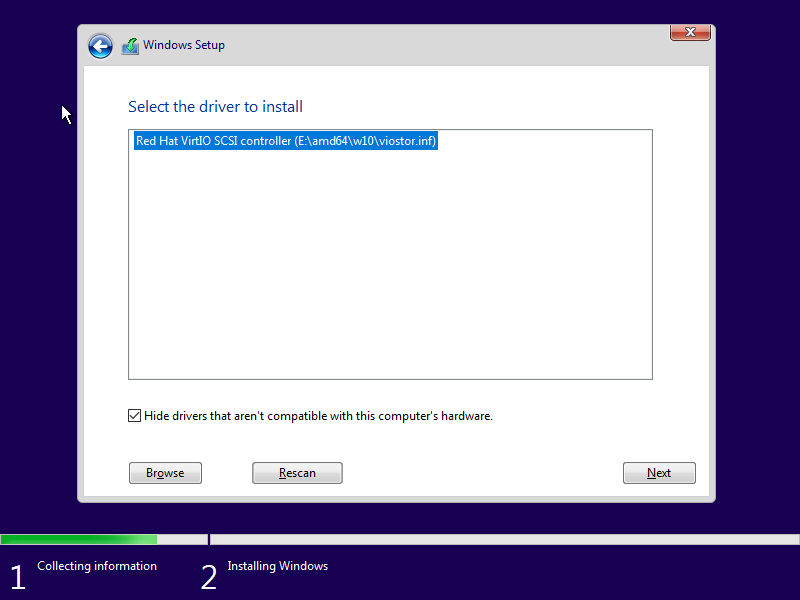
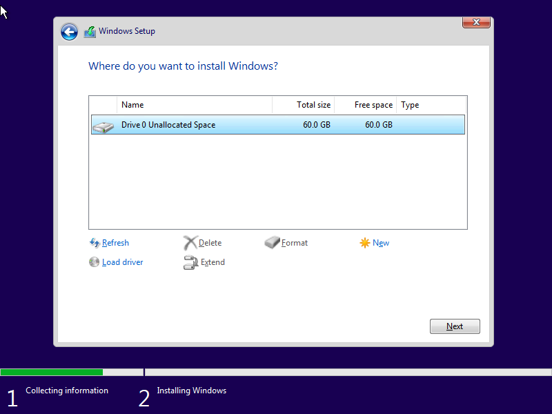

Download virtio (stable) drivers: 
https://docs.fedoraproject.org/en-US/quick-docs/creating-windows-virtual-machines-using-virtio-drivers/index.html

Download the latest windows 10 build iso.

**GENERAL:**

**IMPORTANT**
You have to start customize the vm before installation
set win10 as vm name because of scripts.
set Q35 as chipset
Choose for **UEFI firmware**:

/usr/share/edk2/ovmf/OVMF_CODE.fd

**Popos!**

/usr/share/OVMF/OVMF_CODE_4M.fd

**Opensuse**

/usr/share/qemu/ovmf-x86_64.bin

- Set the max Logical Host CPU's and choose Topology

- Set Memory 8GB or more

- Set Virtio 
- Set the option Cache mode as _writeback_

- Add the 2 ISO's of windows 10 and Virtio to SATA CDROM

- Set 'Virtual network 'default': NAT'
- Set Virtio

**GENERAL:**

We do NOT attach the GPU and HDMI sound at this moment. 
Boot up the VM and install windows in the VM with virtio drivers. 

- Choose load driver 

- Choose the right folder on the mounted Virtio ISO.

The **Virtio** disk is now visible.

Install windows like normal. 

