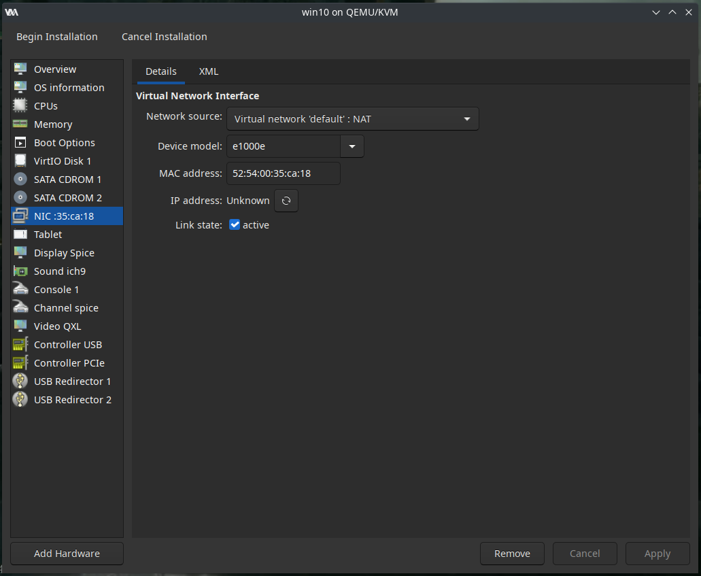

# ...and installing Windows

After having configured the permissions of libvirt, we will now configure the VM.

## Required files

[Download the virtio (stable) drivers iso](https://github.com/virtio-win/virtio-win-pkg-scripts/blob/master/README.md), as they will be needed when installing windows onto your virtual drive

[Download the latest windows 10 build iso](https://www.microsoft.com/software-download/windows10) from Microsoft (**DO NOT** download isos from other non-official sources).

## VM Setup

First, click the "Create machine" button in the top left of the Virtual Machine Manager window. You will now enter the VM setup,by default it will ask you to select an install media (Your Windows 10 iso), select it in the menu that pops up, and it should automatically detect the system type.

You will be asked to create a drive. 50 Gb is enough if you don't plan to install a lot of software, 128 Gb or more is recommended.

Next step is memory, in this screen, ***DO NOT SET THE VM TO USE YOUR WHOLE RAM***, it will instantly crash your VM. Leave *at least* between 1 to 3 Gb of memory to your host. The CPU setting does not matter for now, as we will modify it later.

Step forward, and you will get a summary of your settings. <strong style="color:red">Before proceeding be sure to check "Customize configuration before install".</strong> Also, verify that your VM is named "win10".

**For the followings editions, don't forget to hit "Apply" at the bottom right after each step.**

Now, you are on your VM general settings, in the Overview tab. In this tab, at the bottom, **set the chipset to "Q35"**. Select a UEFI firmware, depending on your distro, the name might differ, but it should always end with "OVMF_\*.fd" or "ovmf-\*.bin". Here are a few examples for different distros:

    
General example

    <pre>/usr/share/edk2/ovmf/OVMF_CODE.fd</pre>

    
Ubuntu, Pop!_OS or other debian distro

    <pre>/usr/share/OVMF/OVMF_CODE_4M.fd</pre>

    
Arch, Manjaro or other arch distro

    <pre>/usr/share/edk2-ovmf/x64/OVMF_CODE.fd</pre>

    
Opensuse

    <pre>/usr/share/qemu/ovmf-x86_64.bin</pre>

    
<strong>You should end up with something like this</strong>

    

**Note for Windows 11:** Windows 11 requires you to have Secure Boot enabled. If you wish to install it, please use the "ovmf_" option that contains `.secboot.`.

Go into the CPUs tab. Check "Copy host CPU configuration", and expand "Topology". Check "Manually set CPU topology", and match your CPU configuration, number of cores and threads. For more infos, search your CPU model online, or run `lscpu | egrep 'Model name|Socket|Thread|NUMA|CPU\(s\)'`

    
<strong>Here is an example for a Ryzen 5900X, 1 socket, 12 cores, 2 threads</strong>

    

Next, select the "Disk 1" drive, it should be the only one you have for now. Set your "Disk bus" to `VirtIO`. Open the "Advanced options", and set the option "Cache mode" as `writeback`.

    
<strong>You should end up with something like this</strong>

    

Head in the "Boot Options", make sure "SATA CDROM 1" is checked, and in the first position, this is the virtual CD drive with your Windows 10 ISO.

    
<strong>Do not tick the NIC, it is not important</strong>

    

 When this is done, click on "Add hardware" at the bottom left of the window, by default "Storage" should be selected. Set the "Device type" to "CDROM device", and set the "Bus type" as SATA, like the other drive.

    
<strong>Using the "Manage..." button, select your virtio-drivers ISO. Make sure everything is correct and click finish.</strong>

    

You do not need to add this CDROM drive to the bootables drives.

Finally, the NIC, to provide your VM with network access. Note that for it to work with the device model set as "virtio", you need to install the guest addons available on the virtio-drivers ISO.

    
<strong>For now, just make sure "Network source" is set to "Virtual network 'default' : NAT"</strong>

    

You can set "Device model" to "virtio" but will not be able to immediately download the latest windows update for a first proper display output, and the NVidia drivers to make sure your card is properly recognized.

***Important note regarding the NIC :*** Sometime, the NIC can make your VM instantly crash. If you get booted to your login screen, try removing the NIC and pass your host ethernet controller to the VM as a backup way of getting internet in your VM. Refer to the FAQ for further infos and help.

You can now click "Begin Installation", start the install process and boot into the Windows 10 setup if everything works correctly.

## Windows installation

You may have noticed that so far, we did not add a GPU to the VM. This is because we need to install Windows 10 first, and make sure that the VM already work as-is.

Follow the Windows setup like normal until you arrive to the drive selection screen. As you can see, it is empty. That is because we are using the virtio type of drive, do not panic we will fix this now.

Choose "Load driver", and you will be presented with a folder browser, navigate to the CD drive containing your virtio drivers, and in that CD drive navigate to `\amd64\w10`, click Ok.

You will be presented with a list of driver~~s~~ to install, on which you can just click on Next.

After a bit of loading, your drive should now appear properly, and you can continue the Windows 10 installation process like normal.

You can now advance to step 6 when you are done with Windows.