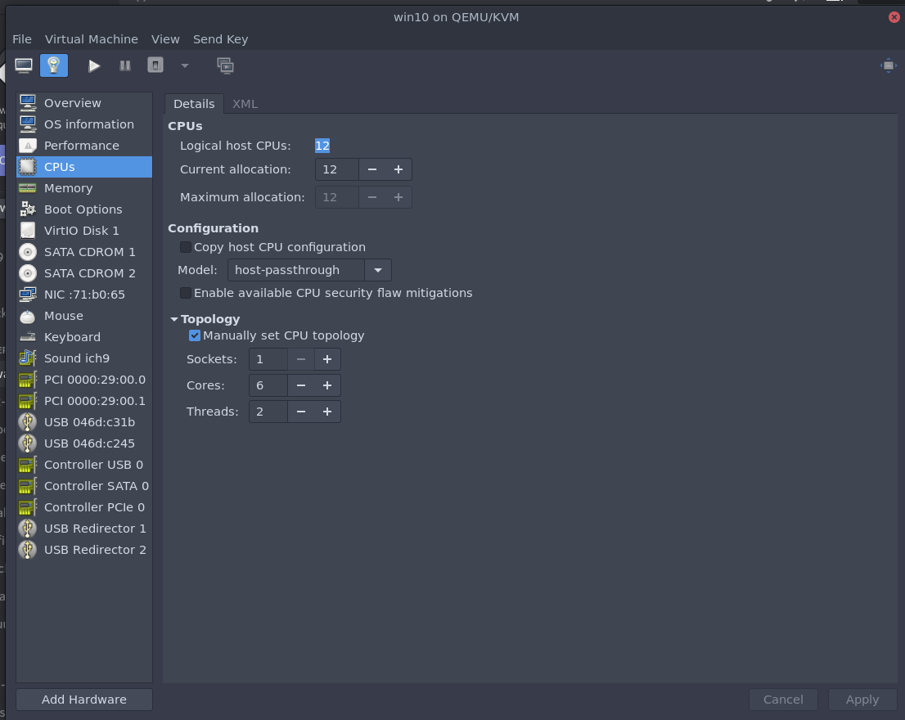
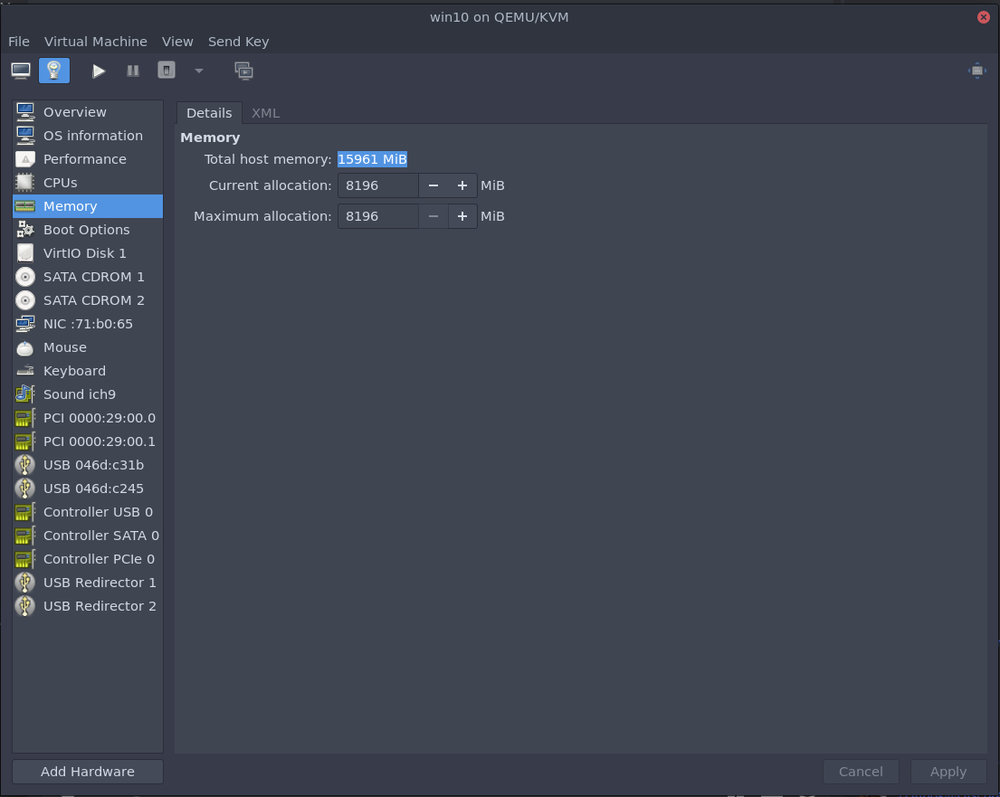
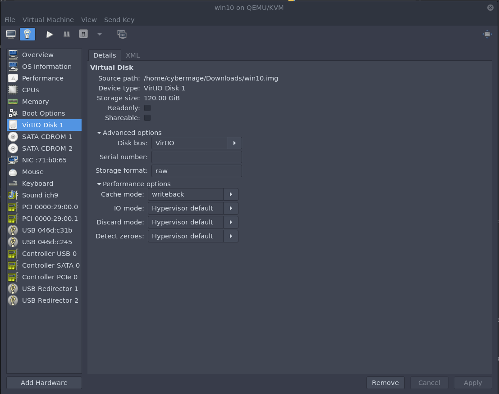

Download virtio (stable) drivers: 
https://docs.fedoraproject.org/en-US/quick-docs/creating-windows-virtual-machines-using-virtio-drivers/index.html

Download the latest windows 10 build iso.

**GENERAL:**

IMPORTANT choice win10 as vm name because of scripts.
Choice for Q35 chipset
Choice for UEFI firmware:

/usr/share/edk2/ovmf/OVMF_CODE.fd

**Popos!**

/usr/share/OVMF/OVMF_CODE_4M.fd

**Opensuse**

/usr/share/qemu/ovmf-x86_64.bin

Choice the max Logical Host CPU's
Choice Topology

Choice Memory 8GB or more

Choice Virtio 
Choice the option Cache mode writeback

Attach the 2 iso's of windows 10 and virtio to SATA CDROM

Choice 'NAT network'
Choice virtio

GENERAL:

We do NOT attached the GPU and HDMI sound on this moment. 
Bootup the VM and install windows in de VM with virtio drivers. 

