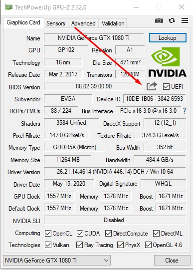
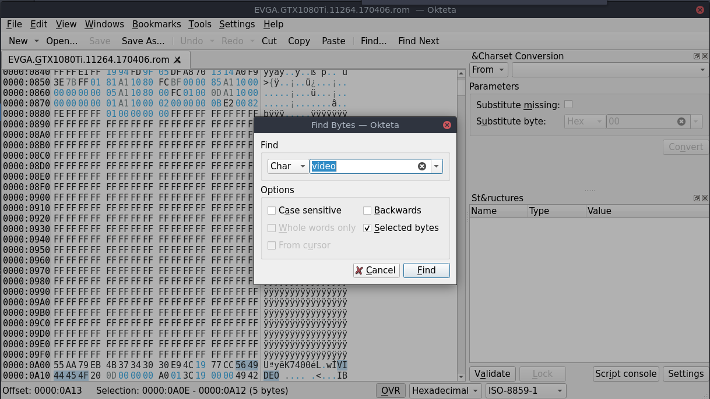
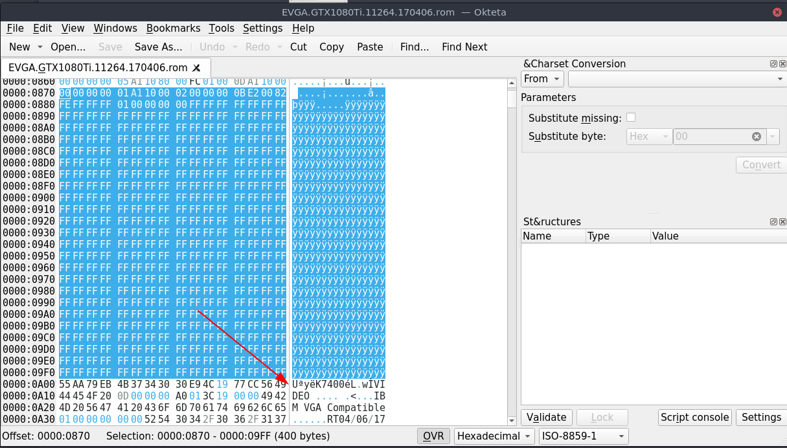

**Most time needed with NVIDIA card and sometimes with AMD cards.**

**_NOTE: DON'T FORGET TO EDIT THE ROM AFTER YOU DUMPED IT, ONLY FOR NVIDIA CARDS. (IF ROM IS NEEDED)_**

EASY WAY

windows 10 can be booted from usb with hirensboot pe. https://www.hirensbootcd.org/download/
start windows 10 and install GPU-Z

* save your bios

**OTHER OPTIONS 1:**

Download the ROM <https://www.techpowerup.com/vgabios/>

But I would **recommend** you the other option. (**dump your own rom,** than you are sure you have the right one)

**OTHER OPTIONS 2:**

Dumping the rom in linux: Download the following:

NVIDIA: <https://www.techpowerup.com/download/nvidia-nvflash/>

AMD: <https://www.techpowerup.com/download/ati-atiflash/>

* Open a TTY ctrl alt f2 (can be different from distro)
* Stop the display manager: **sudo systemctl stop gdm** (can be different like: gdm, sddm , lightdm ... depending on your display manager)
* Unload the nvida modules: **sudo rmmod** _nvidia, nvidia_uvm, nvidia_modeset_
* **Make sure you are in the correct directory + have the correct name of the file for the _NEXT STEP_.**
* Make the file executable with the command: **chmod nvflash** (make sure the name of the file is correct, otherwise your chmod will not work)
* **chmod atiflash**
* **chmod u+x**
* Execute the following command: **sudo ./nvflash_linux --save test.rom** (name can be different just choose a random name for your **ROM** to **save** in this case **_test.rom_**_) _
* Load the nvida module: **sudo modprobe** _nvidia,nvidia_uvm, nvidia_modeset_

Load the windows manager **sudo systemctl start gdm**

**GENERAL**

Patch the rom with a hexeditor. Like okteta. Looking with Char for video.

Note please turn on **OVERWRITE** mode or press **INSERT**!

Remove everything above the U. Save

**Placing the ROM:**

**FEDORA (like other systems with selinux)**

- sudo mkdir /var/lib/libvirt/vbios
- place the rom in above directory with
- cd /var/lib/libvirt/vbios
- sudo chmod -R 660 `<ROMFILE>`rom
- sudo chown username:username `<ROMFILE>`.rom
- sudo semanage fcontext -a -t virt_image_t /var/lib/libvirt/vbios/`<ROMFILE>`.rom
- sudo restorecon -v /var/lib/libvirt/vbios/`<ROMFILE>`.rom

**GENERAL (like other systems with apparmor)**

* sudo mkdir /usr/share/vgabios
* place the rom in above directory with
* cd /usr/share/vgabios
* sudo chmod -R 660 `<ROMFILE>`.rom
* sudo chown username:username `<ROMFILE>`.rom

**OpenSuse**

optional: sudo groupadd your username

The result has to be like:

ls -tlr total 256 -rw-rw---- 1 username username 260096 15 nov 00:43 `<romfile>`.rom