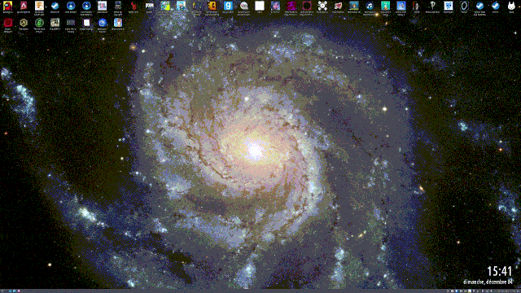
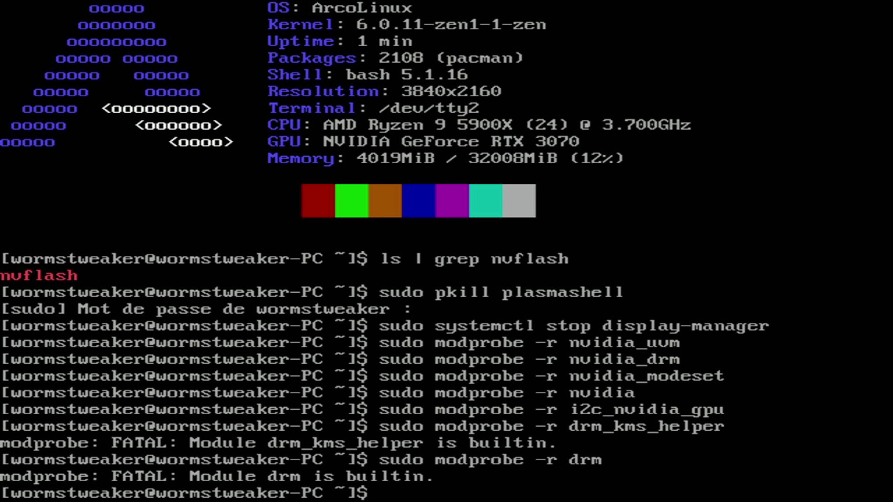
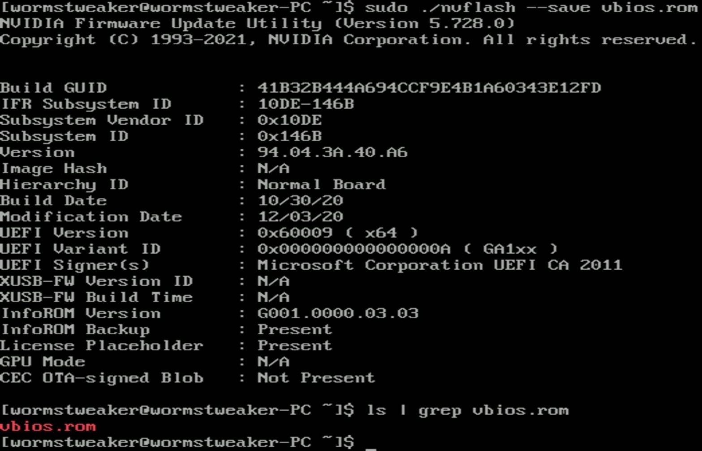
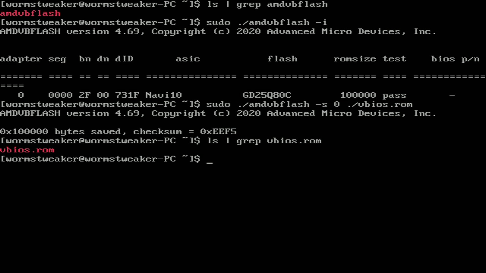
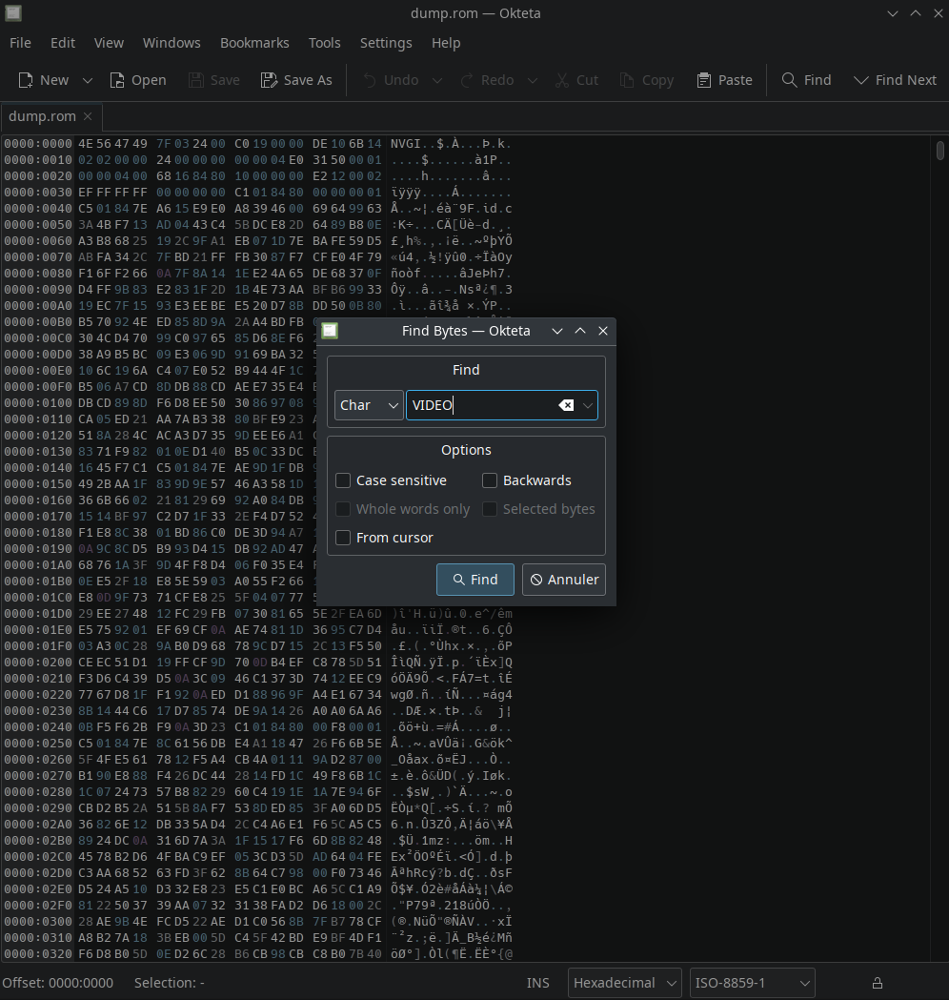
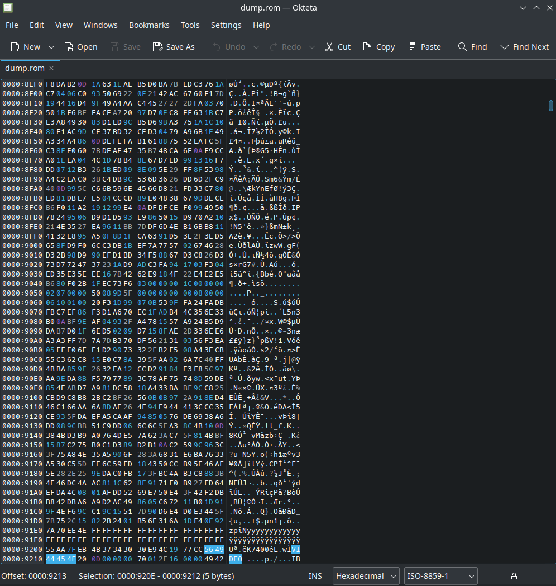
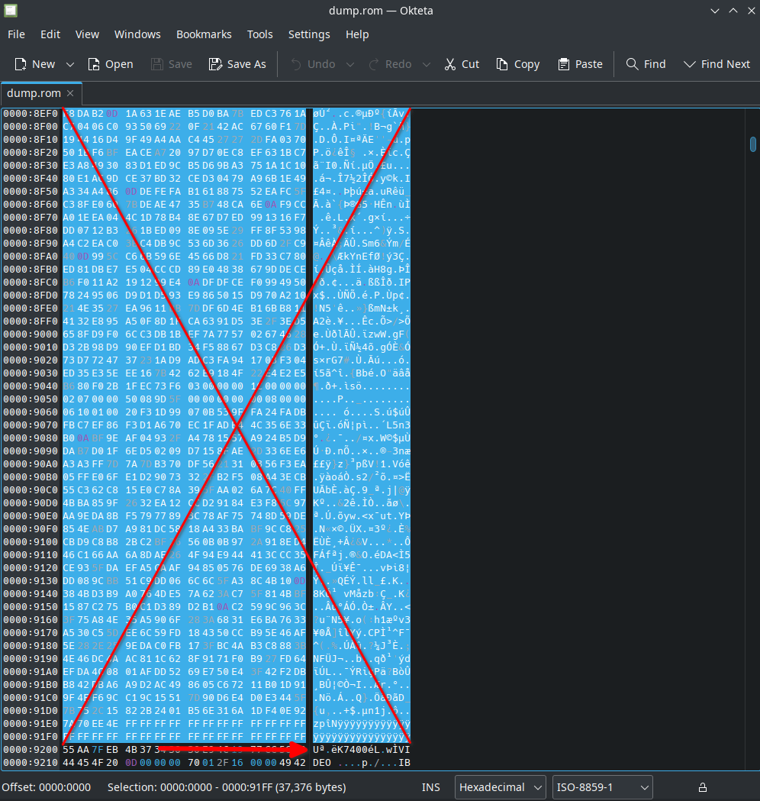
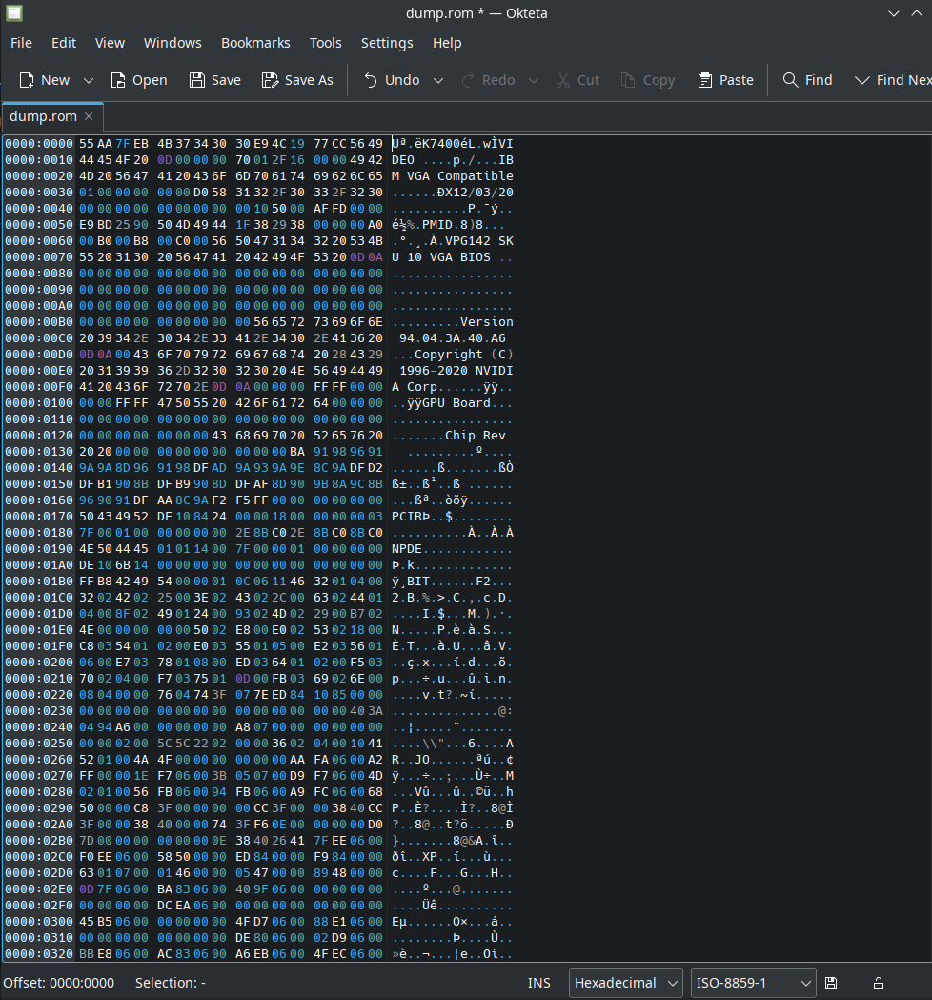

For your VM to properly work with your GPU, it needs to have access to its ROM (also called vBIOS). This is mostly true for NVidia cards, and *some* AMD cards. In this step you have multiple options to dump your card ROM. You can also download your ROM from [TechPoweredUp](https://www.techpowerup.com/vgabios/), but ***this is extremely unrecommended*** and will not be covered here.

**Dumping your ROM is only necessary for NVidia cards, you can still dump your AMD card ROM, but it is not needed in most cases.**

## Dumping your GPU ROM

If you're already on Linux:
<details>
    <summary><strong>Option 1 (Recommended)</strong></summary>
    <details>
        <summary>Tool for NVidia</summary>
        Download the latest version of <a href="https://www.techpowerup.com/download/nvidia-nvflash/">NVFlash Linux</a> in an easily accessible folder (your "Documents" or your "home" folder for example), and unzip the file. You should now have multiple folders for different architectures, the one we are most likely interested in is <strong>x64</strong>. Take note of the file name, it should be something like <code>nvflash</code>.
    </details>
    <details>
        <summary>Tool for AMD</summary>
        Download the latest version of <a href="https://www.techpowerup.com/download/ati-atiflash/">AMDVBFlash / ATI ATIFlash Linux</a> in an easily accessible folder (your "Documents" or your "home" folder for example), and unzip the file. Take note of the file name, it should be something like <code>amdvbflash</code>.
    </details>
    <br>
    Open a TTY with&nbsp;<code>Ctrl + Alt + F2</code> (Try multiple combinations with F&nbsp;<code>X</code>, as it can be different on your distro)<br>
    <br>
    Stop your Display Manager, the command is different depending on your distro DM, here are a few examples:
    <details>
        <summary>Gnome Display Manager (GDM)</summary>
        <pre>sudo systemctl stop gdm3</pre>
    </details>
    <details>
        <summary>Simple Desktop Display Manager (SDDM)</summary>
        <pre>sudo systemctl stop sddm</pre>
    </details>
    <details>
        <summary>LightDM</summary>
        <pre>sudo systemctl stop lightdm</pre>
    </details>
    <i>For Ubuntu users: Go at the end of this sub-section, special instructions await you for this step.</i><br>
    Don't hesitate to Google the command for your specific DM.
    <br>
    <br>
    To successfully dump your GPU rom, you need to tell your kernel to stop using the drivers for it.
    We can do this with the&nbsp;<code>rmmod</code> command.
    Alternatively, <strong>if rmmod isn't an available command on your distro,</strong> you can use&nbsp;<code>modprobe -r</code> instead, the syntax is the same, simply replace it in the commands.
    <br>
    To unload the driver kernel modules, run the following commands in order from top to bottom, specific to your GPU:
    <table>
        <tr>
            <th>NVidia</th>
            <th>AMD</th>
        </tr>
        <tr>
            <th>sudo rmmod nvidia_uvm</th>
            <th>sudo rmmod drm_kms_helper</th>
        </tr>
        <tr>
            <th>sudo rmmod nvidia_drm</th>
            <th>sudo rmmod amdgpu</th>
        </tr>
        <tr>
            <th>sudo rmmod nvidia_modeset</th>
            <th>sudo rmmod radeon</th>
        </tr>
        <tr>
            <th>sudo rmmod nvidia</th>
            <th></th>
        </tr>
    </table>
    <i>Note for NVidia GPUs: Sometimes, a service named <code>nvidia-persistenced</code> can stop you from unloading certain modules. Simply stop this service with <code>sudo systemctl stop nvidia-persistenced</code> to get rid of it temporarily. Since the 5.1X version of the Linux Kernel, the drm_kms_helper and drm are builtin the kernel, and cannot be unloaded, you can safely ignore them if they don't unload.</i>
    <br>
    <br>
    <br>
    Now, place yourself in the folder containing nvflash/amdvbflash, make it executable with <code>chmod +x</code>, and dump your rom:
    <table>
        <tr>
            <th>NVidia</th>
            <th>AMD</th>
        </tr>
        <tr>
            <th>sudo chmod +x nvflash</th>
            <th>sudo chmod +x amdvbflash</th>
        </tr>
        <tr>
            <th>sudo ./nvflash --save vbios.rom</th>
            <th>sudo ./amdvbflash -s 0 vbios.rom</th>
        </tr>
    </table>
<i>Note for AMD GPUs: 0 in this previous command is your adapter, if yours isn't 0, you can figure out which number you need to put here using <code>sudo ./amdvbflash -i</code></i>
    <br>
    <br>
    Results of the dump:
    <details>
        <summary>For NVidia</summary>
        
    </details>
    <details>
        <summary>For AMD</summary>
        
    </details>
    <br>
    We now need to reload the modules we unloaded previously. You can do so by simply typing the unloads command we did earlier, in reverse order, and replacing <code>rmmod</code> by <code>modprobe</code> like so:
    <table>
        <tr>
            <th>NVidia</th>
            <th>AMD</th>
        </tr>
        <tr>
            <th>sudo modprobe nvidia</th>
            <th>sudo modprobe drm_kms_helper</th>
        </tr>
        <tr>
            <th>sudo modprobe nvidia_uvm</th>
            <th>sudo modprobe amdgpu</th>
        </tr>
        <tr>
            <th>sudo modprobe nvidia_drm</th>
            <th>sudo modprobe radeon</th>
        </tr>
        <tr>
            <th>sudo modprobe nvidia_modeset</th>
            <th></th>
        </tr>
    </table>
    <br>
    Likewise, after reloading the kernel modules, we now need to restart our display manager, here are a few examples:
    <details>
        <summary>Gnome Display Manager (GDM)</summary>
        <pre>sudo systemctl restart gdm3</pre>
    </details>
    <details>
        <summary>Simple Desktop Display Manager (SDDM)</summary>
        <pre>sudo systemctl restart sddm</pre>
    </details>
    <details>
        <summary>LightDM</summary>
        <pre>sudo systemctl restart lightdm</pre>
    </details>
    <br>
    You can also reboot your host with<code>sudo reboot</code> instead of reloading all the modules.
    <br>
    <br>
    You should now have a dumped GPU rom, specific to your GPU.
    <br>
    <details>
        <summary>Special section for Ubuntu 22 (and probably next versions)</summary>
        Ubuntu 22 has a very annoying way to stop your DE. It uses something different from other Debian based distro. You first need to disable your DE like this:
        <pre>sudo systemctl set-default multi-user
gnome-session-quit</pre>
        This will set your default display mode to a TTY, and stop gnome. At this point, follow the previous steps of the guide to dump your vBios normally. When you are done, you can restore your DE with this:
        <pre>sudo systemctl set-default graphical
sudo systemctl start gdm3</pre>
        <br>
        <i>Save yourself, don't use the mess that is Ubuntu 22.</i>
        <br>
    </details>
</details>

If you still have access to Windows on your system:
<details>
    <summary><strong>Option 2</strong></summary>
    Start up Windows 10 and install GPU-Z. Run it, and click on this icon.
    <br>
    
    <br>
    This should save a vbios file for you. Keep it safe on a USB stick or external drive, to transfer it on Linux later. You can keep Windows opened for the next step, as you can edit your vbios using <a href='https://mh-nexus.de/en/hxd/'>HxD</a> instead of Okteta.
</details>

Or, if you don't have access to Windows anymore, and that the Linux method didn't work:
<details>
    <summary><strong>Option 3</strong></summary>
    You can try to create a FreeDOS USB stick, to boot on and use nvflash/atiflash.
    <br>
    <a href='https://unetbootin.github.io/'>Download UNetbootin</a>, run the software (<code>chmod +x</code> the executable then run it from your terminal as root), select the FreeDOS distribution, and flash it on a USB stick (as the live USB iso is less than 500mb, a 1Gb USB stick or higher is enough).<br> If UNetbootin cannot see your USB stick, format it as fat32. Once your USB is formatted, and FreeDOS is installed, copy the <strong>DOS</strong> version of nvflash/amdvbflash (As the time of writing, the DOS latest version of AMDVBFlash is 4.68, the latest DOS version of nvflash is 5.163) on the USB stick.<br>
    Reboot your host, and boot on your newly made FreeDOS USB. Since FreeDOS emulates a DOS environment, you will probably have to set your boot mode to Legacy temporarily, <strong>do not forget to set it back to UEFI after you are done.</strong> On the FreeDOS boot menu, quickly select option 5, you will be put in a DOS prompt. Move yourself to the B: drive (Simply type <code>B:</code>), and check that the nvflash/amdvbflash tools are correctly on your USB, using the DIR command. You should see the exe file alongside the FreeDOS files.<br>
    Now, like in Options 1, you can run the dumping software, and get your rom.
    <table>
        <tr>
            <th>NVidia</th>
            <th>AMD</th>
        </tr>
        <tr>
            <th>nvflash.exe --save vbios.rom</th>
            <th>amdvbflash.exe -s 0 vbios.rom</th>
        </tr>
    </table>
    Your rom should now be saved on your USB stick. To reboot, press your power button once, to trigger an ACPI shutdown, as there is no shutdown or reboot command in FreeDOS. <strong> Don't forget to set back your system to UEFI boot.</strong>
    <br>
    <br>
    Alternatively, if this method still doesn't work, you can try out <a href="https://www.hirensbootcd.org/download/">Hiren's Boot CD</a> and use Option 2 once you are booted on it.
    <br>
    As a complementary ressource, you can consult the <a href="http://wiki.freedos.org/wiki/index.php/How_to_Create_a_USB_Boot_Disk_Using_FreeDOS">FreeDOS wiki</a> for more explanations and tips on how to create a USB stick with FreeDOS on it.
</details>

## Patching your dumped ROM

Patching your ROM is very easy. **This operation is not necessary with AMD ROMs.** You will need an hex editor like Okteta on Linux, or, if you are still on windows, HxD. Open ***a copy of your rom file, keeping the original somewhere safe,*** in the editor of your choice. Press Ctrl + F to access the search function, and search for `VIDEO`, on the `Char` setting:




Now, place your cursor **before** the first `U` before the `VIDEO` we just searched, like this, and select everything before it:



When everything before `U` is selected, press your DEL key, and delete your selection. If it isn't working in Okteta, switch the edit mode by pressing your **INSER** key or by switching mode in the bar at the bottom of Okteta's window (INS or OVR mode). You should end up with a result similar to this one:



Save the file under a different name, like `patched.rom`. Your ROM is now patched and can be used!

## Placing your ROM

This step ***is different*** depending on your Linux distro. Please place your ROM accordingly to your distro.

<details>
    <summary><b>For most distro (distro with apparmor that are not Fedora based)</b></summary>
Create a folder called <code>vgabios</code> in <code>/usr/share/</code>
<pre>
sudo mkdir /usr/share/vgabios
</pre>
Place your patched ROM in the newly created directory, and sets its permissions:
<pre>
cp ./patched.rom /usr/share/vgabios/
cd /usr/share/vgabios
sudo chmod -R 660 patched.rom
sudo chown yourusername:yourusername patched.rom
</pre>
</details>
<details>
    <summary>For Fedora based distro (Fedora, Nobara, or distros with SELinux)</summary>
Create a folder called <code>vgabios</code> in <code>/var/lib/libvirt/</code>
<pre>
sudo mkdir /var/lib/libvirt/vgabios
</pre>
Place your patched ROM in the newly created directory, and sets its permissions:
<pre>
cp ./patched.rom /var/lib/libvirt/vgabios/
cd /var/lib/libvirt/vgabios/
sudo chmod -R 660 patched.rom
sudo chown yourusername:yourusername patched.rom
</pre>
Set the SELinux context for the file:
<pre>
sudo semanage fcontext -a -t virt_image_t /var/lib/libvirt/vgabios/patched.rom
sudo restorecon -v /var/lib/libvirt/vbios/patched.rom
</pre>
</details>

Your ROM should now resemble this permission wise:
```
-rw-r--r-- 1 wormstweaker wormstweaker 962048  9 oct.  21:30 patched.rom
```