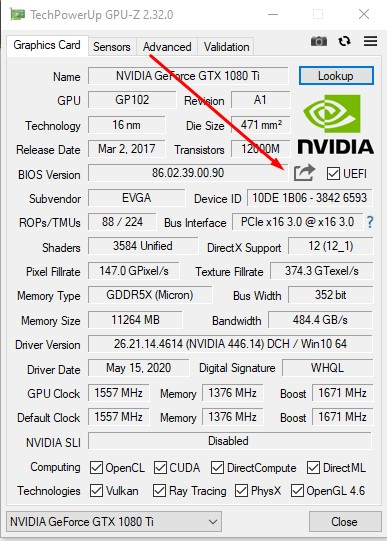
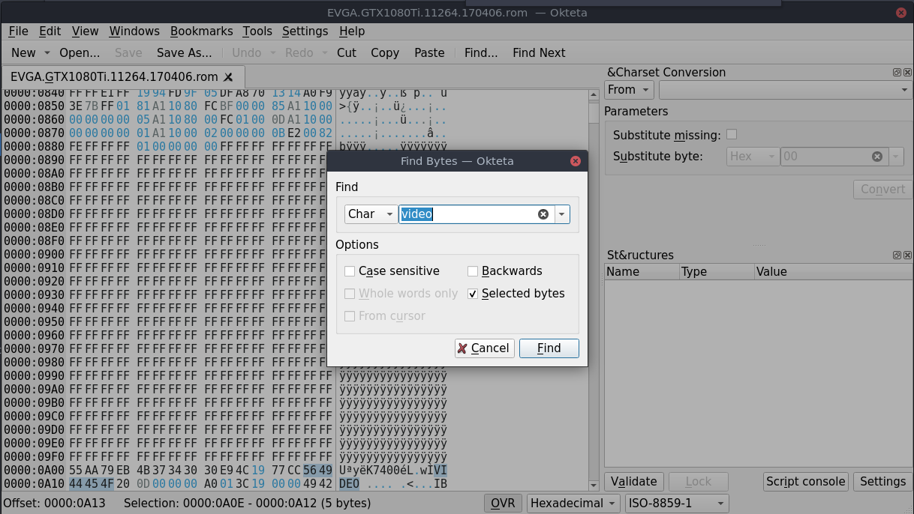
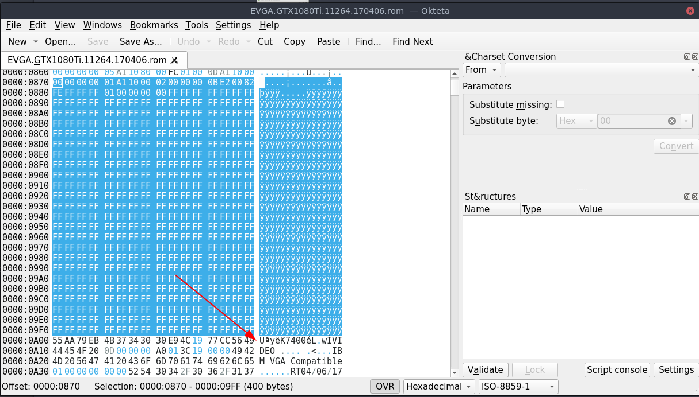

**WARNING only needed for serie 10 van nvidia.**

EASY WAY

start windows 10
install GPU-Z

save you're bios

OTHER OPTION:

Download the ROM
https://www.techpowerup.com/vgabios/

OTHER OPTIONS 2:

Dumping the rom in linux:
Download the following:

NVIDIA:
https://www.techpowerup.com/download/nvidia-nvflash/

AMD:
https://www.techpowerup.com/download/ati-atiflash/

Open a TTY
ctrl alt f2 (can be differ from distro)

Stop the windows manager
sudo systemctl stop gdm

unload the nvida module
sudo rmod nvidia

chmod nvflash / atiflash
chmod u+x <nvflash>

execute the following command:
sudo ./nvflash_linux --save 1080ti.rom

Load the nvida module
modprobe nvidia

Load the windows manager
sudo systemctl start gdm

**GENERAL**

Patch the rom with a hexeditor. Like okteta. Looking with Char for video.

Remove everything above the U.
Save 

