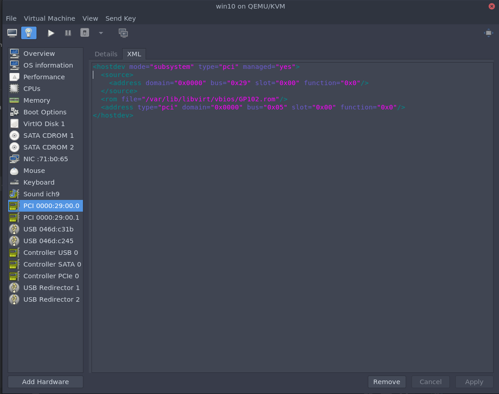

Optional only needed when you need a rom file.

<hostdev mode="subsystem" type="pci" managed="yes">
  <source>
    <address domain="0x0000" bus="0x29" slot="0x00" function="0x0"/>
  </source>
  <address type="pci" domain="0x0000" bus="0x06" slot="0x00" function="0x0"/>
</hostdev>

**ARCH / FEDORA **

add this line <rom file='/var/lib/libvirt/vbios/GP102.rom'/> 

**POPOS! / Ubuntu / Linux Mint / MANJARO / OPENSUSE (or other apparmor distro)**

add this line <rom file="/usr/share/vgabios/GP102.rom"/> 

GENERAL:

Remove spice / qxl stuff in VMM

