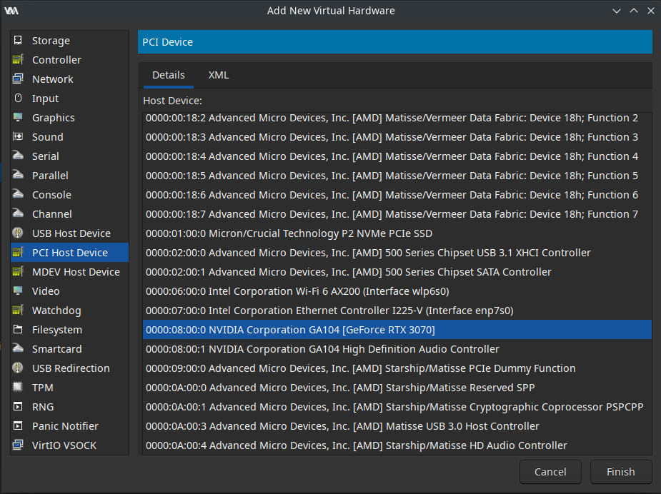
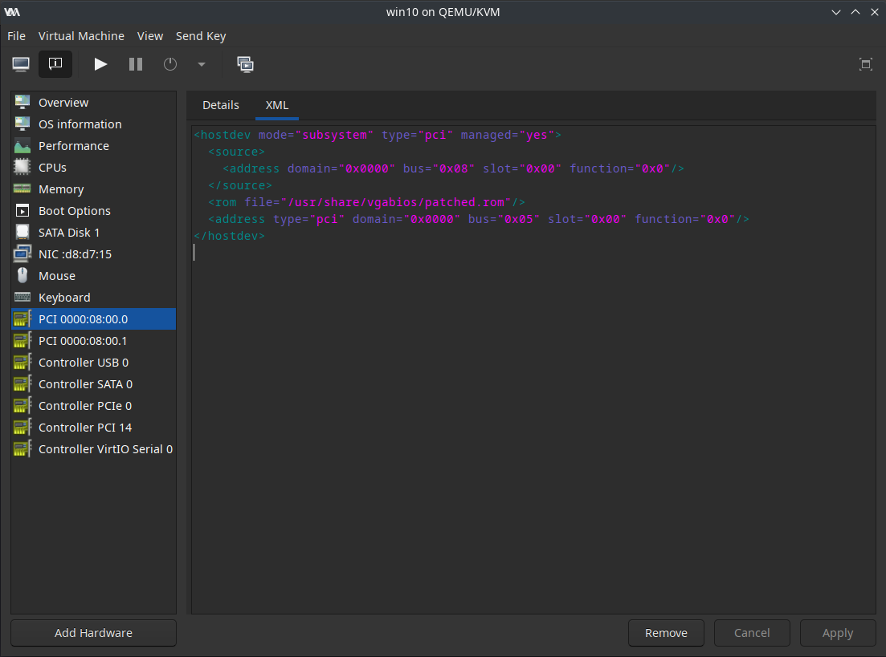
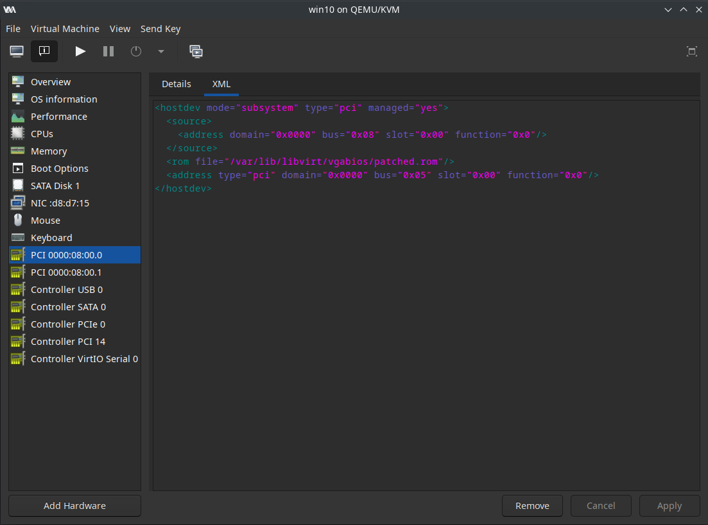

We will now finally add the GPU of our host to the VM. But first we have some cleaning and setting up to do.

## Removing the virtual display

By default, the VM is created with a Display Spice device and a Video QXL device, which we both need to remove as they are not needed anymore. Simply select them, starting with the Display Spice, and click on "Remove".

If the remove option is greyed out, remove any USB redirector you have in your VM devices (Any device with a yellow and grey USB symbol).

If you STILL have the option greyed out, go in the Overview tab, in your XML, search for these 4 XML blocks, and remove them:
```XML
  <graphics type="spice" autoport="yes">
    <listen type="address"/>
    <gl enable="no"/>
  </graphics>
```
```XML
  <audio id="1" type="none"/>
```
```XML
  <video>
    <model type="bochs" vram="16384" heads="1" primary="yes"/>
    <address type="pci" domain="0x0000" bus="0x05" slot="0x00" function="0x0"/>
  </video>
```
```XML
  <channel type="spicevmc">
    <target type="virtio" name="com.redhat.spice.0"/>
    <address type="virtio-serial" controller="0" bus="0" port="1"/>
  </channel>
```

## Adding your GPU and your ROM

This step is same for every distro. ***However, your ROM path will be different, depending on step 6).*** Please change your ROM path accordingly to the previous steps you have done.

Press "Add Hardware", navigate to "PCI Host Device", and in the list that is presented to you, search for your GPU and its Audio Controller (you should have taken note of their IOMMU IDs in step 3), as well as their names):



Go in the XML tab of your newly added GPU, and add the following line:
```
<rom file='/usr/share/patched.rom'/>
```
Again, ***please edit this line depending on the steps you followed previously, at step 6) of this guide***, this is the path for most distros. You should end up with this:



For **Fedora based distros**, this is your line and result:
```
<rom file='/var/lib/libvirt/vgabios/patched.rom'/>
```



**Note: In most cases, it is not necessary to add your rom to the Audio Controller of your GPU. You can however still add it if you encounter problems with unaligned regions later in your troubleshooting.**